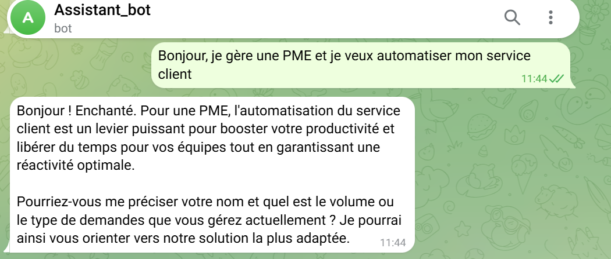
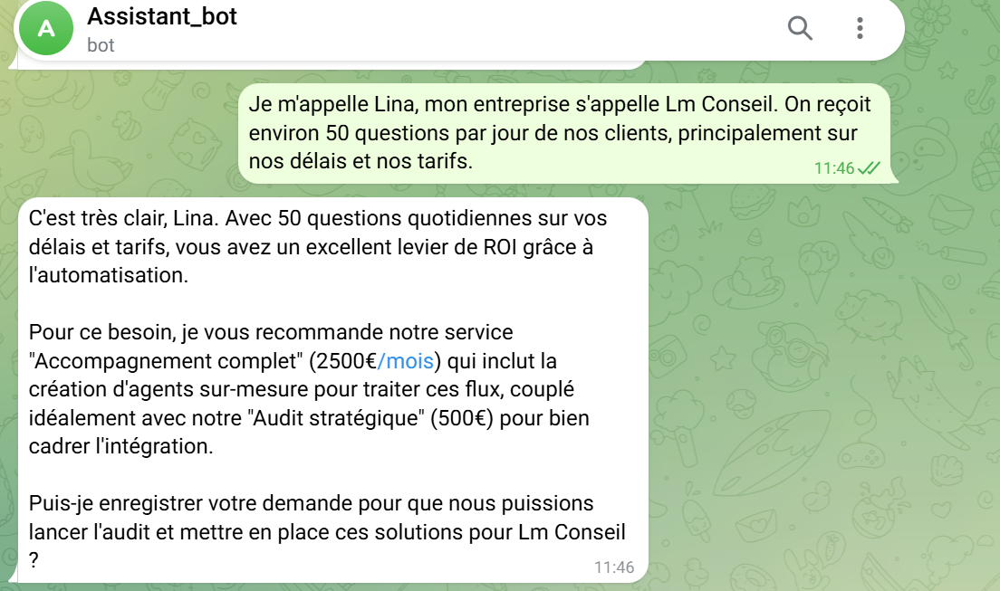
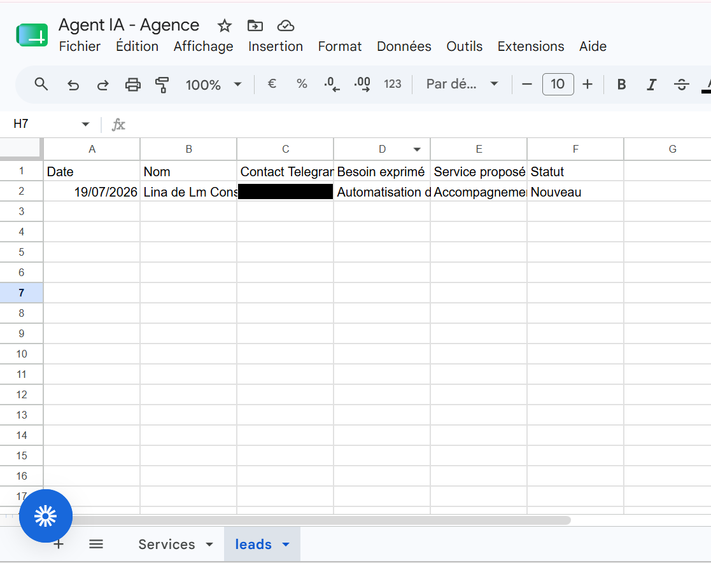
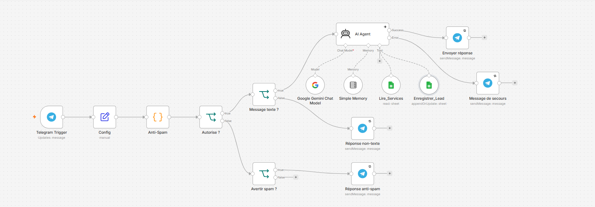

**Gestion de la robustesse :**
- Error Workflow dédié avec alerte admin en temps réel (Telegram)
- Retry automatique sur les nœuds critiques (modèle IA, Google Sheets, envoi Telegram)
- Filtrage des messages non-texte (photos, audio, stickers) avec réponse de secours
- Anti-doublon : upsert des leads par identifiant de contact plutôt que création systématique
- Anti-spam : limitation du nombre de messages par utilisateur sur une courte fenêtre de temps

## 🛠️ Stack technique

| Composant | Rôle | Outil |
|---|---|---|
| Orchestration | Logique du workflow | n8n |
| Cerveau (LLM) | Compréhension et raisonnement | Google Gemini API |
| Mémoire | Contexte de conversation | Simple Memory (n8n) |
| Connaissance | Catalogue de services | Google Sheets |
| CRM | Enregistrement des leads | Google Sheets |
| Canal | Interface conversationnelle | Telegram Bot |

Tous les outils utilisés sont accessibles en version gratuite.

## 📸 Démonstration

### Conversation avec l'agent

### Enregistrement automatique du lead

### Vue d'ensemble du workflow

## 💡 Ce que ce projet démontre

- Compréhension des composants fondamentaux d'un agent IA : cerveau, mémoire, connaissance, outils, prompting
- Capacité à construire un système robuste, pas seulement une démo qui fonctionne une fois : gestion d'erreur, garde-fous, alertes
- Maîtrise d'un environnement no-code pour livrer rapidement une solution fonctionnelle et évolutive
- Approche orientée business : l'agent qualifie et documente des prospects réels, pas juste un chatbot de démonstration

## 🚧 Limites actuelles et pistes d'évolution

- Mémoire conversationnelle non persistante (perdue au redémarrage) — évolution possible vers une mémoire externe (Postgres/Redis en free tier)
- Traite uniquement les messages texte pour le moment
- Pas encore de déduplication avancée au-delà de l'identifiant de contact
- Architecture pensée pour un secteur (services/agences) — adaptable à d'autres secteurs via la base de connaissance

## 🙋 À propos

Projet réalisé pour maîtriser l'architecture des agents IA de bout en bout : conception, construction, robustesse, et présentation. Ouvert aux opportunités en automatisation IA / no-code.

[LinkedIn](https://www.linkedin.com/in/lina-maouche-774510334/?locale=fr) · [Contact](linamaouchedev@gmail.com)
